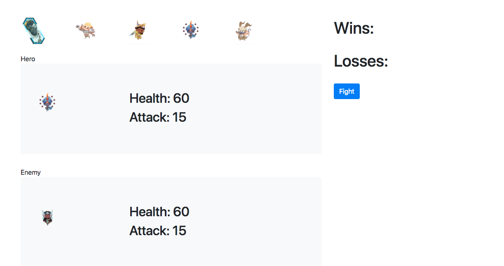

# JQuery Assignment

### Overview

In this assignment, I have created a game where a player is assigned a random hero, and then chooses an enemy to fight. 

A player may fight itself as one of the villains. 

### Winning 

* In order to win you must beat all five opponents.

### Losing

*You lose by being depleted of your health points.

**Good Luck!**
# Hakuti.github.io
