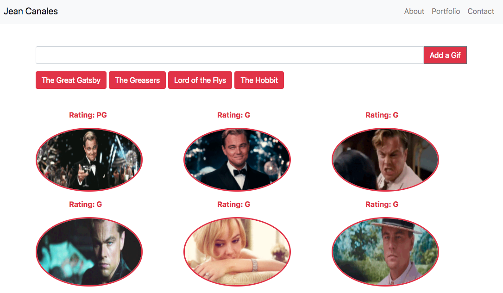

# Giphy Assignment

### Overview

In this assignment, I have created an input that generates a new button and add it's to the gif buttons. You can then click on the buttons to generate gif images.

A player may fight itself as one of the villains. 

### Generates Gifs

*The gifs are contained in a rounded border

### Clicking Gifs

*Click the gifs to change them from still to animated and vice versa.

**Good Luck!**
# Hakuti.github.io
